# Green skills education: cost, quality, and future demand

*Generated from `data/courses.csv`, `data/macro_indicators.csv`, `data/future_skills.csv`.*
*Pipeline: `scripts/analyze.py`. Currency USD unless noted. Date of this run: 2026-09-15.*

## What this answers

1. What do green-skills **courses actually cost per person**?
2. How does **cost compare with quality** pulled from reviews, credentials, and employer recognition?
3. Which **future courses / skills** are worth building inventory for?
4. How does **system-level training spend** (OECD, UK ESS, LinkedIn, WEF, BLS) sit against course prices?

## Headline numbers

| Signal | Figure | Source |
| --- | --- | --- |
| Green hiring vs green skills growth | **7.7% vs 4.3%** (still ~2×) | LinkedIn Green Skills Report 2025 |
| Hiring premium for green talent | **+46.6%** vs overall workforce | LinkedIn 2025 |
| Green hires now in non-green titles | **53%** | LinkedIn 2025 |
| OECD workers in green-driven occupations | **20%** | OECD Employment Outlook 2024 |
| Share of adult courses with green content | **2.1–14.1%** (AU, DE, SG, US) | OECD 2024 |
| Employer skills change by 2030 | **39%** | WEF Future of Jobs 2025 |
| Climate mitigation as business transformer | **47% of employers** | WEF 2025 |
| US solar PV installer median wage | **$53,140**; jobs **+37%** 2025–35 | BLS OOH |
| US wind turbine tech median wage | **$64,120**; jobs **+30%** 2025–35 | BLS OOH |
| UK employer spend per trainee | **£2,710** (lowest in the series) | DfE ESS 2024 |
| Croatia green/digital voucher | **up to €3,000 / person** | OECD |

Training supply is thin relative to job demand. Cheap MOOCs cover literacy; **license and standard-setter courses** are where employer-recognized quality concentrates.

## Cost vs quality

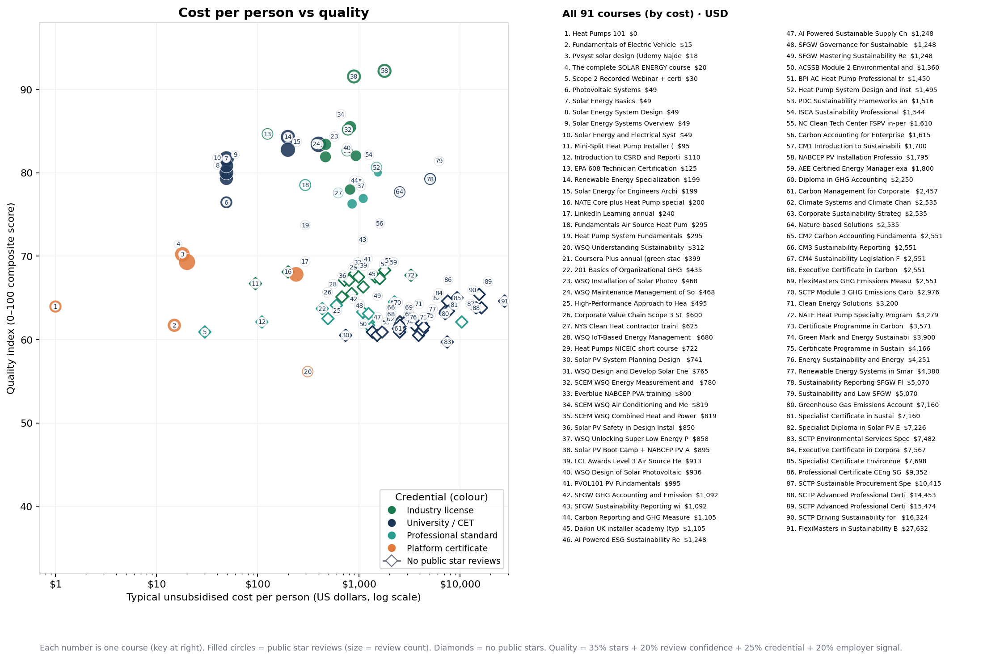

How to read it:

- **Right and high** = expensive and strong (Harvard GHG, MIT PE, NABCEP PVIP).
- **Left and high** = bargains with real review volume (SUNY/UB Coursera solar, CU Boulder renewables).
- **Left and mid** = cheap marketplace courses: high review counts, weaker credentials.
- **Open diamonds** = no public star ratings; quality is inferred from the credential (GHG Protocol, GHGMI, AEE, SEI).

### Highest quality index

| name | provider | cost_usd_typical | rating | n_reviews | quality_index | source_url |
| --- | --- | --- | --- | --- | --- | --- |
| NABCEP PV Installation Professional Certificatio | HeatSpring | 1795 | 4.72 | 1,080 | 92.21 | https://www.heatspring.com/courses/58-hour-nabce |
| Solar PV Boot Camp + NABCEP PV Associate Exam Pr | HeatSpring / Sean White | 895 | 4.72 | 1,046 | 91.54 | https://www.heatspring.com/solar-pv-boot-camp-na |
| SCEM WSQ Air Conditioning and Mechanical Ventila | SEAS | 819 | 4.50 | 224.00 | 85.46 | https://courses.myskillsfuture.gov.sg/search?TP_ |
| SCEM WSQ Energy Measurement and Audit | SEAS | 780 | 4.50 | 216.00 | 85.18 | https://courses.myskillsfuture.gov.sg/search?TP_ |
| EPA 608 Technician Certification | HeatSpring / Brynn Cooksey | 125 | 4.50 | 128.00 | 84.65 | https://www.heatspring.com/courses/nys-clean-hea |

### Best value (quality adjusted for log cost)

| name | cost_usd_typical | quality_index | value_score | quality_per_100usd |
| --- | --- | --- | --- | --- |
| Heat Pumps 101 | 0 | 63.95 | 63.95 | — |
| PVsyst solar design (Udemy Najdeah) | 18 | 70.21 | 48.51 | 390.03 |
| The complete SOLAR ENERGY course Beginner to adv | 20 | 69.30 | 46.92 | 346.50 |
| Solar Energy Basics | 49 | 81.68 | 46.12 | 166.69 |
| Solar Energy and Electrical System Design | 49 | 80.83 | 45.64 | 164.96 |

### Cheapest reviewed courses that still clear quality ≥ 70

| name | cost_usd_typical | rating | n_reviews | quality_index |
| --- | --- | --- | --- | --- |
| PVsyst solar design (Udemy Najdeah) | 18 | 4.60 | 2,000 | 70.21 |
| Solar Energy Systems Overview | 49 | 4.70 | 874.00 | 80.01 |
| Solar Energy and Electrical System Design | 49 | 4.70 | 733.00 | 80.83 |
| Solar Energy Basics | 49 | 4.80 | 2,600 | 81.68 |
| Solar Energy System Design | 49 | 4.70 | 480.00 | 79.31 |

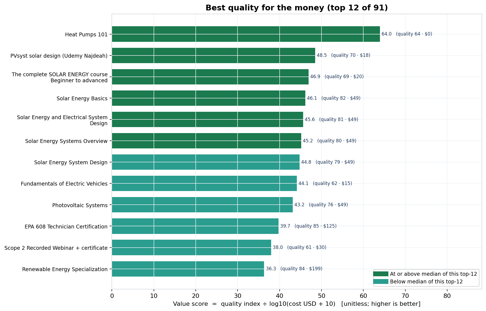

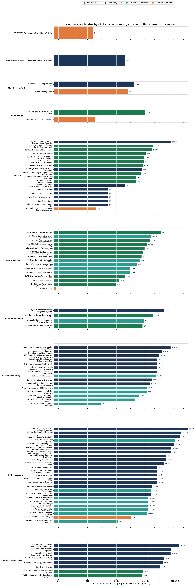

## Cost bands (rule of thumb)

| Band | Typical $ / person | What you get | Quality pattern from reviews |
| --- | ---: | --- | --- |
| Free / audit | 0 | Literacy, no (or weak) credential | High ratings, low employer weight |
| Marketplace sale | 13–25 | Tool tutorials (PVsyst, solar overview, EV intro) | Lots of reviews; wide quality spread |
| University MOOC certificate | 49–80 | Single course certificate | 4.6–4.8 stars, 100–2,600 reviews |
| Specialization / Plus year | 199–399 | Multi-course university stack | Strong ratings; credential mid-tier |
| Official standard e-learning | 30–600 | GHG Protocol Scope 2 ($30) to Scope 3 ($600) | Few public stars; high employer signal |
| Industry license bootcamp | 800–1,800 | NABCEP PVA/PVIP, AEE CEM | 4.7 stars + pass-rate data (HeatSpring 88%) |
| Professional diploma | 2,250–3,200 | GHGMI diploma, MIT PE | Thin public reviews; high brand |
| University microcertificate | 7,000+ | Harvard Extension GHG | Highest brand, highest price |

**Implication:** moving from a $20 Udemy overview to an ~$895 NABCEP PVA bootcamp is the largest quality jump per dollar for **hands-on solar jobs**. For **white-collar carbon accounting**, GHG Protocol $30–$600 and GHGMI $435 beat Harvard $7,160 on value unless the buyer specifically needs the Harvard brand.

## Future courses to stock

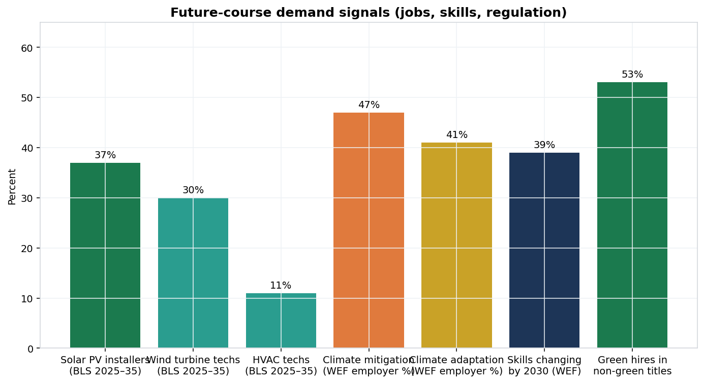

Priority inventory (demand × training gap):

1. **Heat-pump / HVAC electrification** — UK needs ~100k heat-pump engineers; US HVAC vacancy ~110k heading toward ~225k.
2. **Energy management** — LinkedIn 2025 fastest-growing green skill (AI/data-center load).
3. **Environmental stewardship** — first time in WEF top-10 growing skills.
4. **Solar PV install + design** — BLS +37% jobs; solar design skills spiking on profiles.
5. **Wind turbine service** — BLS +30%, median $64,120.
6. **GHG / CSRD / ESRS reporting** — regulation-pulled white-collar skill; cheap intro (€100) and expensive professional paths coexist.
7. **EV / charging / powertrain** — WEF top-15 growing role.
8. **Grid flexibility + storage** — rising in LinkedIn 2025 skill relevance.
9. **Sustainable procurement** — fastest green skill in 2024 (+15% adoption).
10. **Green skills inside non-green jobs** — 53% of green hires. Courses for finance, ops, and procurement beat “green job” bootcamps alone.

## System-level spend vs course prices

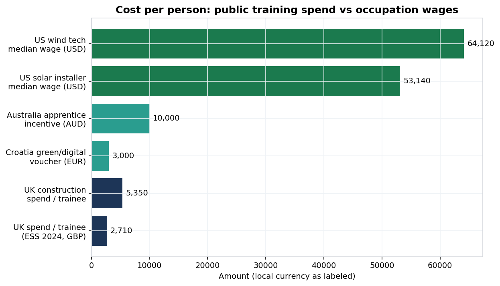

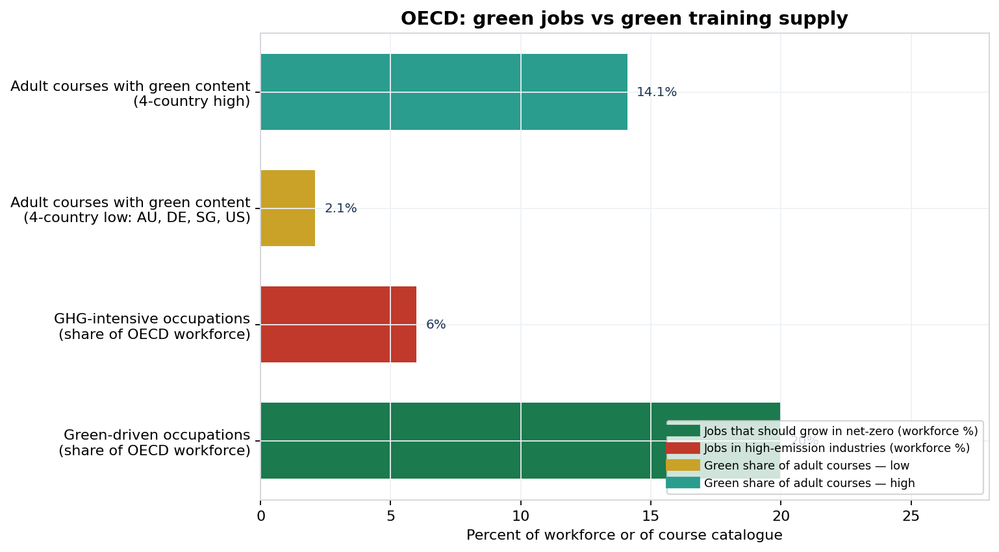

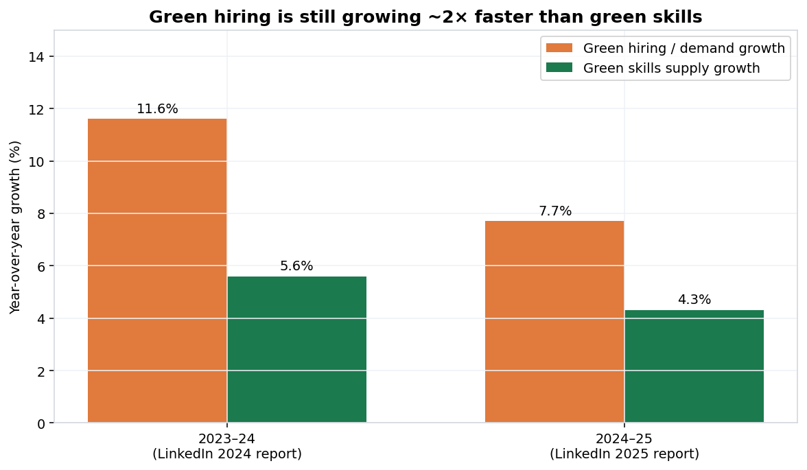

A public voucher of **€3,000** (Croatia) or UK average **£2,710 / trainee** covers:

- several university specializations, **or**
- one NABCEP-class bootcamp plus exam, **or**
- a GHGMI diploma, **or**
- **not** a Harvard microcertificate.

OECD: **20%** of workers are in green-driven occupations but only **2–14%** of catalogued adult courses carry green content. That is the core supply gap the course market is not filling.

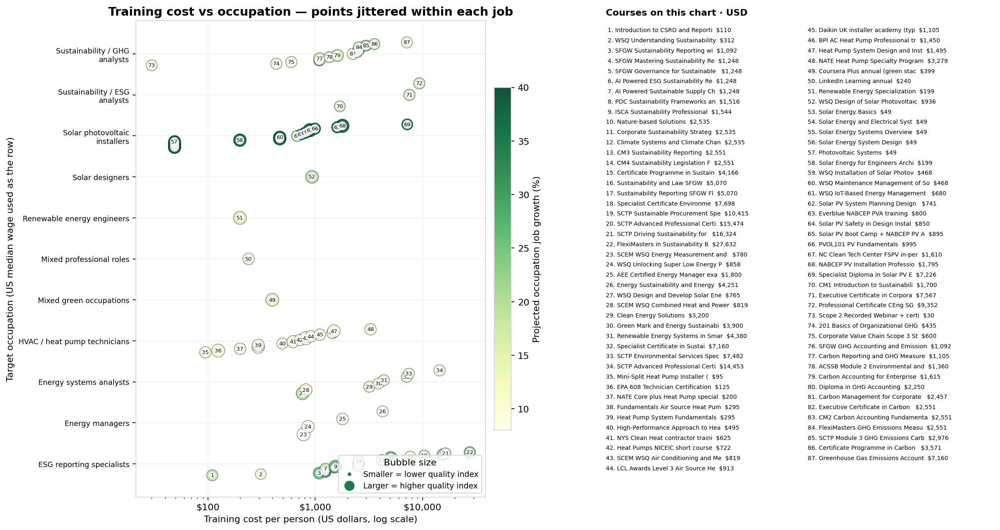

## Quality method (so you can rerun it)

```
quality_index =
    0.35 * (stars / 5 * 100)          # 70 if no public stars (neutral)
  + 0.20 * (log10(reviews+1) / 4 * 100)  # 0 if no reviews
  + 0.25 * credential_score           # license 100, standard 88, university 80, platform 42
  + 0.20 * employer_signal            # 0-100 coded from hiring recognition
```

Stars without reviews are discounted. A 5.0 with 8 reviews cannot beat a 4.7 with 1,000 reviews plus a license.

## Heat pumps: the outcome gap (this refresh)

This run added **14 heat-pump / HVAC courses** (UK MCS pathway, US NATE/BPI/NYSERDA, HeatSpring, manufacturer academies). That was the thin catalog relative to demand (UK ~100k heat-pump engineers; US HVAC median **$61,010**, jobs **+11%** 2025–35, ~110k unfilled).

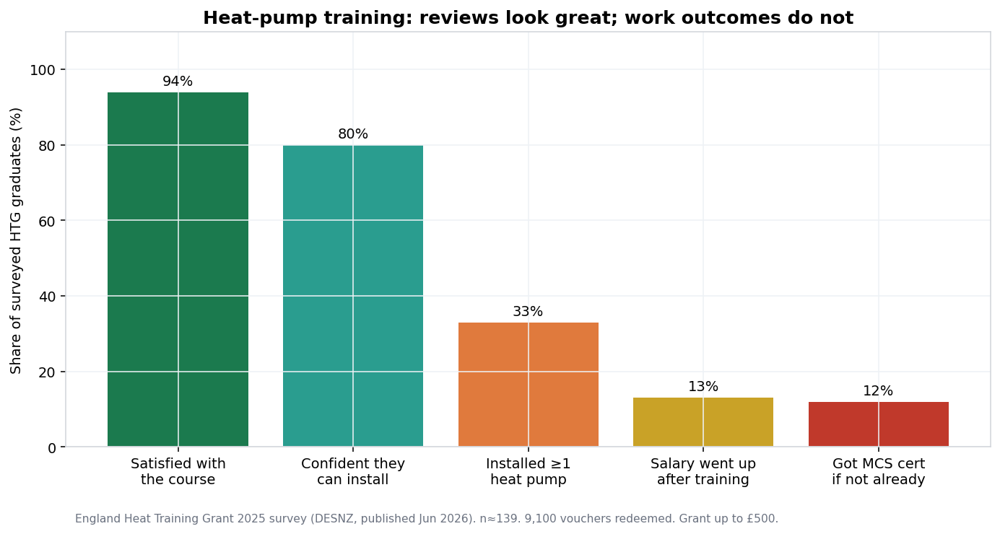

England’s Heat Training Grant is the rare case where **course reviews and job outcomes are both measured**:

| After HTG-subsidised training | Share |
| --- | ---: |
| Satisfied or very satisfied with the course | **94%** |
| Confident they can install | **80%** |
| Installed at least one heat pump | **33%** (was 27% in 2024) |
| Salary increased | **13%** (72% unchanged) |
| Obtained MCS if they were not already certified | **12%** |

Grant is **£500 / person**. Unsubsidised UK L3 ASHP classroom is about **£702 ($913)**; net after grant ~**$263**. NYSERDA-sponsored mini-split training is **$95** for NY residents vs **$1,795** out of state — subsidy, not pedagogy, is doing most of the cost work.

**Implication:** stocking more 4.7-star heat-pump MOOCs will not close the installer gap. The bottleneck after a short course is MCS / NATE / a first paid install, not another video.

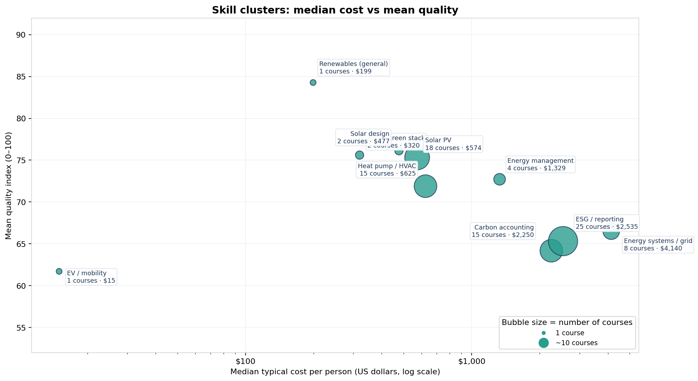

## Conversion: first install and MCS (this follow-up)

MCS is a **business** accreditation, not a personal exam. BUS’s **£7,500** grant only pays if the job is MCS-certified. HTG’s **£500** pays for the course and stops there.

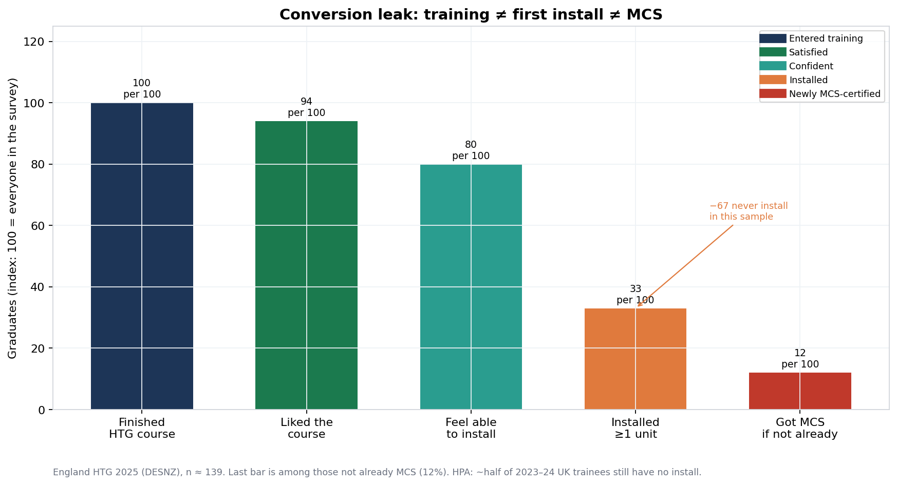

Per 100 England HTG graduates (DESNZ 2025):

| Stage | Per 100 |
| --- | ---: |
| Finished the course | 100 |
| Liked it | 94 |
| Feel able to install | 80 |
| Installed at least one unit | **33** |
| Already MCS when they trained | 16 |
| Got MCS afterwards if they were not | **12** |

Industry-wide the same leak shows up: HPA counted **7,800** course completions in 2023 and **7,000+** in 2024; **about half still have no installation**. LCL Awards / Nesta name the blockers: confidence, MCS paperwork, no first customer, admin (heat-loss, quoting, DNO), large brands taking the work.

**What actually converts** (evidence, not more catalogues):

1. **A supervised first install** — Nesta Start at Home: funded kit in the engineer’s own house. Scale-up: **2,000 registered, 250 live, 83 completed**. Around half of pilot home-installers then explored their own MCS. Daikin adds **£750 off** the first *customer* job.
2. **MCS umbrella for jobs 1–N** — HPIN (EDF): join **£0**; **£250 design + £250 audit** per job; they hold MCS and file BUS. Alto, Baxi, manufacturer networks do the same. This is how people install *before* they can sell MCS themselves.
3. **Own MCS only if volume is coming** — NICEIC 2026/27 one-technology year: application **£114** + cert **£846** + MCS licence **£66** (all inc VAT), plus consumer code ~**£385** year 1. MCS’s own bundle is **£1,090** year 1 + **£30 per certificate**, then **£890**/year.

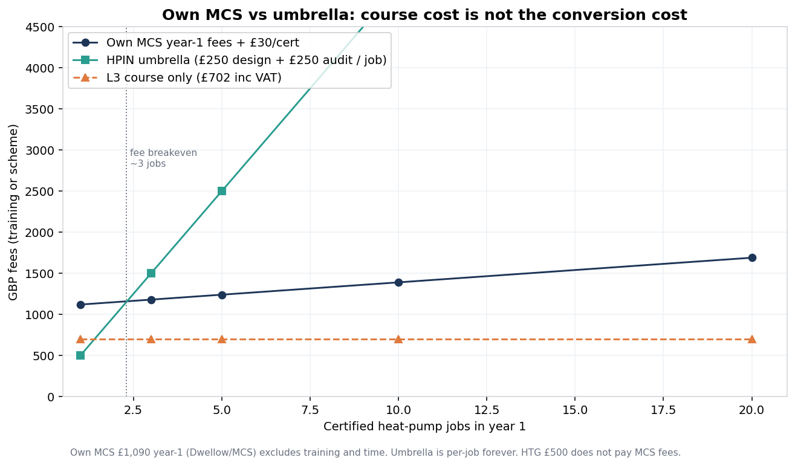

Fee breakeven vs HPIN-style umbrella is about **3 certified jobs**. After that own MCS is cheaper on cash fees. The real cost of own MCS is still **QMS time, insurance, a first site the customer will accept, and 2–4 months**. That is why 94% like the course and 12% become newly MCS.

**Money the voucher does not cover**

| Stack | GBP | USD @ 1.30 |
| --- | ---: | ---: |
| L3 ASHP classroom (inc VAT) | 702 | 913 |
| HTG (England) | −500 | −650 |
| Net course after HTG | 202 | 263 |
| Own MCS year-1 fees (ex training) | 1,090 | 1,417 |
| Course + own MCS year 1 | ~1,792 | ~2,330 |
| Umbrella first job (HPIN) | 500 | 650 |
| Start at Home first install | 0 kit | 0 |

HTG is sized for the **course**. Conversion is sized like **£1,000–£1,800 plus a house to practise on**.

Workforce gap this leak sits in: Payaca / HPA-type estimates **<3,000** MCS heat-pump businesses and **2,000–4,500** full-time installers against **~31,000–41,000** needed this decade (HPA 30,590 by 2028; Nesta/CCC ~38,000 more by 2030). Octopus still cites **~100,000** heat-pump engineers for the UK build-out.

## NTU Singapore (this refresh)

Added **13 NTU PACE / Nanyang Business School** offerings. These are classroom CET with SkillsFuture funding, not MOOCs. **No public course-level star ratings** (NTU as a MySkillsFuture *provider* is 4.2 from 16,427 reviews — institution-level). Quality in the scatter is therefore credential-weighted.

Singapore demand this is aimed at (Green Skills Committee 2025):

| Signal | Figure |
| --- | --- |
| Sustainability reporting professionals | **2,000 (2023) → 4,000 (2030)** |
| Solar / storage / smart grid / power-import workforce | **~420 (2022) → 720 (2026)** (+70%) |
| Green-jobs demand growth 2024 | **+27%** (fastest in Asia, LinkedIn) |
| Carbon Markets Academy at NTU | **300** professionals by 2027 |
| Green workforce budget | **S$235m** |

**List vs what a funded Singaporean actually pays** (USD @ SGD 0.78; typical in the CSV is the **unsubsidised list**, same rule as UK HTG):

| NTU offering | List (inc GST) | SC 21–39 / PR | SC ≥40 (MCES) |
| --- | ---: | ---: | ---: |
| CM2 Carbon Accounting Fundamentals | S$3,270 (~$2,551) | S$1,770 (~$1,381) | S$1,170 (~$913) |
| SCTP GHG module | S$3,815 (~$2,976) | S$1,145 (~$893) | S$445 (~$347) |
| SCTP Sustainability Reporting + AI (full) | S$19,838 (~$15,474) | S$5,951 (~$4,642) | S$2,311 (~$1,803) |
| Sustainable Finance certificate | S$5,341 (~$4,166) | S$2,891 (~$2,255) | S$1,911 (~$1,491) |
| Carbon Markets exec (per module) | S$3,270 (~$2,551) | S$1,770 | S$1,170 |
| Renewable Energy Systems in Smart Grids | ~S$5,616 (~$4,380) | ~S$1,685 (70%) | SME ETSS ~S$654 |

Compare: **GHGMI 201 is $435** with an exam; **NTU CM2 is $2,551 list / ~$913 after 70%**. You are paying for IES Chartered Engineer (SG) pathway, classroom, and Singapore statute — not the same product as a $435 e-learning. After MCES, NTU carbon accounting lands near **GHG Protocol Scope 3 ($600)** and below **Harvard ($7,160)**.

The SCTP reporting certificate at **$15k list** is the ISSB/ACRA compliance stack. That is the local analogue of “regulation-pulled white-collar green skill,” not a solar-installer bootcamp.

This catalogue is **not** all 640+ sustainability CET courses SSG has counted. It is a working sample: NTU plus SkillsFuture Green Workplace (SFGW-SR) programmes, NUS, SMU, SIT, SEAS solar/SCEM, NTUC, Temasek Poly, Vertical Institute. Lookup URLs are in `source_url` on every row. Singapore subsidy bands and nett fees are in `data/sg_subsidy_rules.csv` and `data/sg_course_funding.csv`.

**What reviews can and cannot do**

- They measure learner satisfaction (clarity, production, instructor).
- They do **not** measure job placement. HeatSpring’s **88% NABCEP pass rate** and the HTG **33% install rate** are better outcome metrics than stars.
- Marketplace 4.4 with 11k reviews is a real popularity signal, not an employer signal.

## Data limits

- Udemy list prices are fictional for most buyers; **sale price** is used as typical.
- Coursera specialization cost assumes ~4 months at $49/mo, not Coursera Plus ($399/yr) unless the row is Plus.
- Several professional courses (GHG Protocol, GHGMI, AEE, SEI) publish **no star ratings** — quality is credential-weighted.
- One EV row is low-confidence (estimated reviews).
- UK course USD uses **GBP 1.30**; NTU Singapore uses **SGD 0.78**. SkillsFuture / HTG net cost is in notes; `cost_usd_typical` is unsubsidised list.
- Wages are US BLS occupation medians, not course-specific placement. HVAC wage is used as the heat-pump proxy (no separate BLS heat-pump installer SOC).
- LinkedIn “green skills” are self-reported profile skills, not assessed competence.
- HTG survey n is small (~139); treat percentages as directional.

## How to refresh

```
python scripts/analyze.py
```

Add rows to `data/courses.csv` (keep column names). Re-run. New PNGs land in `output/`, scored table in `output/courses_scored.csv`, this report in `reports/cost-quality-report.md`.

Full collector map: `PIPELINE.md`.
